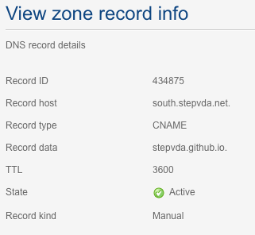

# GitHub Pages setup #

Goal: use [GitHub Pages](https://pages.github.com/) to publish selected notes online. Pages uses the [Jekyll](https://jekyllrb.com/) and Front Matter constructs to render Markdown into nice looking HTML by applying templates. 

Github Pages also allows to use custom domains so I created the "south" subdomain of my "stepvda.net" domain. [south.stepvda.net](https://south.stepvda.net) now redirects to a new Git repository where my puslished notes are stored and applies the configured template so you don't have the impression of accessing the standard GitHub website. Under the hood it is accessing <https://github.com/stepvda/published>.

Custom domains and **free SSL certificates**. Like many other cloud providers (Google Cloud, App Engine, Firebase, ...) you get a free SSL certificate automatically generated for your custom domain.

## Step1: create new Git repository ##

I wanted to separate my notes from other projects so I created a separate Git repository. 

* Creating sub folder `published` under my `new notes`folder
* Excluding this folder from the existing git repository for my regular notes by adding the follwoing to .gitignore of my new notes folder:

````git
# Custom rules 
published/*
````
* Initialising a new git repository in the published folder by running `git init` there
* Publishing the new repository to GitHub using  the GitHub desktop  app
	* File >> Add local repository
	* Push to public GitHub (private is payable)
* This created <https://github.com/stepvda/published> 

## Step2: create some test content ##

* must have a `readme.md` file in the root `published` folder. 
* created some additional .md files with some test content including one with an image that I also added to the repository to see if it is included using the following markdown:

````markdown
next is an image being displayed
!(alt image text)[image.png]
````


## Step3: configure pages

* Go to settings on the new Github page (<https://github.com/stepvda/published/settings>)
* Scroll down to the GitHub Pages section
* Select `master branch` 
	* Note that if I wanted to create Pages on an existing project I should create it in a separate `documentation`branch
* Choose a theme
	* I chose an existing theme for now but really I want to get my hands dirty and create my own using this this is an important Todo
* Pages are now accessible through the pages url <stepvda.github.io/published>

## Step4: setup new subdomain ##

* access my DNS admin site and configure a new DNS `CNAME` record that will basically redirect request to GitHub. This is the config of the new record: 
* *Note:* don't forget to add the dot `.` after the record data `stepvda.github.io.` That was my initial mistake.
* As soon as the DNS record is activate and it was able to propagate to global DNS servers the new sub-domain south.stepvda.net will now point to stepvda.gitbut.io. 
* But this isn't enough we need to tell github to expect redirects so it can point to the published pages repository.
	* Go back to repository settings (<https://github.com/stepvda/published/settings>) and under pages section complete custom domain field with `south.stepvda.net`
	* It took 30 min or so for GitHub to generate an SSL certificate. So until this is done you can access the custom domain via unencrypted http://south.stepvda.net
* It's a good idea to check "enforce HTTPS" on the settings page (once the certificate is generated). Accesses via regular http:// will get redirected to https://

## Usage ##

[Check this note for more on publishing](adding_changes_from_vscode.md)


*Note:* It takes up to 10 minutes for GitHub to generate the HTML from the markdown `.md` files using Jekyll.
I also noticed that there seem to be 2 stages to this process. Stage one will generate the HTML, stage 2 will rewrite links to the `.md`file into `.html` file that point to the newly generate html fie. So you may see your generated note for a while but the links pointing to it might not work yet.  Just wait a few minutes and it should work.

## Todo ##

- [ ] Create my own theme  
