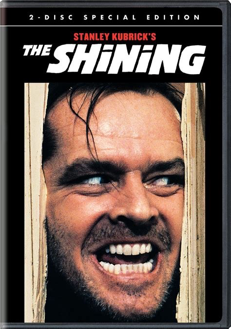

# mind fuck number 1 : anti-mirror 

> convince a victim that something is written on their face that they cannot see themselves.

It is written in a very special ink or perhaps paint, that one cannot see when looking in the mirror. However others always see it clearly at the first glimpse of the victims face. It could for instance have been written in bright red on pale skin with freckles. The trick consists of scaring the victim by letting he or she imagine this possibility initially as if it were a fairy tale as if something magic were really to exist. Then bit by bit add this "what-if sentences".  "Could this be". "Why not possible as if you know everything there is to know?"   Provide more details that fills in the blanks of what starts of as an abstract thing, the color of the letters, maybe they were carved scars with a knife showing hellish red blood depicting letters, words and such. Maybe an image of the movie "The Shining" with Jack Nicholson's insane face?  Each time detail is added the victim has to, for a brief moment, leave our reality where most of us do not believe in magic tricks. This "switching" shortly submerges the victim into something unknown. As with many "mind fuck tricks" we instinctively are afraid of anything unknown. We do not have time to think rationally about this before our primal, autonomous nervous system, sometimes called "reptile brain", already has a response. Possibly even an action ready is already provided and executed before we can realize it. However these actions or thoughts mostly can be categorized in "fight or flight". If we don't force our mind to halt this process then there is the danger that it takes over. As with many psychologic manipulations the "anti-mirror" trick can, if executed well by a trained, not so caring, professional (also referred to as asshole) lead to a cascade effect. An overwhelming trust of violence provides that much fear that we no longer can react to halt this intense emotion and otherwise let our rational mind, the frontal cortex (forehead) kick in. In most cases our rational thinking would do what we have been able to learn, experience or deduct in a mostly logically even mathematical scientific way. This in itself has previously or even just in time been able to create a "counter emotional response" of its own. This usually manifest in confidence boost. One that says: "no nothing in the mirror means they are telling me lies". "Maybe some refraction of light, like in a prism, could break up light in a full rainbow spectrum but that would require perhaps something transparent, say water when you just washed your face." "However your face is actually dry",  so you realize with confidence that you are being told lies. Besides even refracted light would not spell anything, right?! To make sure that the aggressor stays ahead of the victim it is usually import to confuse. For example this can be done by introducing seemingly unrelated pieces of information that may not even matter as far as what content they bring to the "anti-mirror manipulation story!" A new association to another thing that instinctively scares normal functioning human beings is introduced, again an initial non-rational, yet very emotional response emerges first, likely interrupting, confusing, the rational process that by now was underway to try and make sense of this crazy story of anti-mirror letters on ones face that must very well say something I can only be very ashamed off. Sometimes that what is supposedly written in anti-mirror is explicitly said at the beginning of the manipulation. Sometimes it is implicitly referenced to. In other cases it never is told or intentionally left out all together. Again this shows that content is less important then emotional response for these manipulations to work. 

We cannot block our emotions. We can acknowledge them and learn how to best cope with them. They are not wrong.They are not right. Emotions exist and are always true and real. However we can also, even on our own make a mess of things without evil help or which-craft. Understanding what you feel, where it might be coming from is a first step. Next you need to think what you can do. Two things usually; option A; let an emotion grow, make it feel more intense, or option B; try to distract it by introducing an other, preferably, more positive emotion then fear. You might start to think of how Disney animation pictures have wiches with all sort of tricks but they always have a happy end and everybody lives happily ever after. Anything can work, associate to an event from the past that ended well for you. How did you feel? what did you do?

All of this might for some sound a bit ridiculous. This is silly you must think. Problem is you had to read. Reading is a very rational ability. Reading is something we all had to learn, this in turn is we can remember, something we can grasp at any time from our memory almost in a way that is universal. All people who learned a given language, say English, and learned how to read and write it in Latin script or alphabet can now read this text. We all remember how to read, because we leared the same thing. It's almost universal (for those grasping the language of Shakespear at least). 

This is unlike emotions which we tend to remember through past experiences that left use with the same emotion even if the experience itself has nothign alike with what you are now picturing for anti-mirror for instance.

Take away language, words and make it all happen say 50 times faster, it is all still happening and you're left with mostly feelings that seek interpretation but one isn't provided in time before the next scary thing arrives and does the same. __The cascade begins__. Your rational thinking suppressed and uncontious processes do most of the thinking and even some of the acting. This can be dangerous and in worse case lead to psychosis. However less subtle and unaware effects are more likely goals. A brief moment of stress is enough to make forget that thought when you were already somewhat tired. 

This thing you forgot is not simply erased like you would delete a file on a computer's hard disk. The way we store, remember or recall is more complex. I tend to think of it as little islands of thoughts that have bridges to other islands of thoughts, linking an almost infinite number islands. Fear, stress, shame, possible other negative emotions don't usually "blow up" the bridges towards that particular thought you needed to forget, instead they are now covered with the same paint used by "anti-mirror". You don't see the thought because there is no visible bridge associating that thought with you're thinking. Still it's there, just not in time.

One last bit. We can never remember all we need or want when we need or want it. Try not to think of this as a limitation but as something helpful. Sure computers maybe faster, do more things in parallel, calculate better, but how do they know what is important for you in *the here and now*? Somehow your mind does a trick of its own, that I for one, still find almost magical for lack of a more scientific word. We are given a window to the world, a television screen in our head above what our eyes see with a large selection of islands with thought. We can learn to view the "top-hits" of thoughts that provide the most useful ideas for the present. Mostly we learn this uncontiously. 

